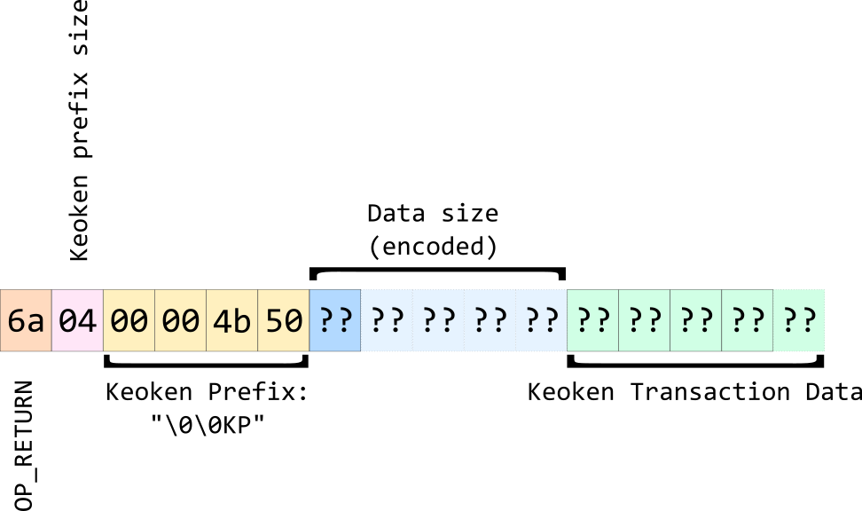

# Keoken

### Technical specification (Draft)
### Version 0.1

*Juan Garavaglia (juan@bitprim.org)*

*Fernando Pelliccioni (fernando@bitprim.org)*

*Mario Dal Lago (mario@bitprim.org)*

*Ramiro Carlucho (ramiro@bitprim.org)*

*Dario Ramos (dario@bitprim.org)*

*Guillermo Paoletti (guillermo@bitprim.org)*

*Gerardo Arceri (gerardo@bitprim.org)*

*Renzo Barrionuevo (renzo@bitprim.org)*

*Mateo Friedman (mateo@bitprim.org)*

*Mariano Orsili (mariano@bitprim.org)*

**_Bitprim Project Inc._**

## Document Versioning

<table>
  <tr>
    <td>Version</td>
    <td>Date</td>
    <td>Reviewer</td>
  </tr>
  <tr>
    <td>0.1</td>
    <td>2018-Jul-26</td>
    <td>Bitprim Project Inc.</td>
  </tr>
</table>

 
## Introduction

This document defines the transaction types supported by the *Keoken Protocol*.

*Keoken Protocol* is built over any cryptocurrency compatible with the Bitcoin scripting language. Specifically *Keoken* needs for OP_RETURN (0x6a) operation code. Right now *Keoken* could be implemented, over Bitcoin Cash (BCH), Bitcoin (BTC) and Litecoin (LTC), but it is not limited to them. The cryptocurrency where Keoken is implemented is called *Transport Currency* or *Transport Coin* (from here on we can call it only *Transport*).

## Keoken Transportation

Keoken needs to be transported on an existing cryptocurrency with Bitcoin compatible scripting language that supports the OP_RETURN (0x6a) operation code.

The transportation protocol is defined in the following way:

Data size (encoded): (link a https://en.bitcoin.it/wiki/Script#Constants)

<table>
  <tr>
    <td>N/A</td>
    <td>1-75</td>
    <td>0x01-0x4b</td>
    <td>(special)</td>
    <td>data</td>
    <td>The next opcode bytes is data to be pushed onto the stack</td>
  </tr>
  <tr>
    <td>OP_PUSHDATA1</td>
    <td>76</td>
    <td>0x4c</td>
    <td>(special)</td>
    <td>data</td>
    <td>The next byte contains the number of bytes to be pushed onto the stack.</td>
  </tr>
  <tr>
    <td>OP_PUSHDATA2</td>
    <td>77</td>
    <td>0x4d</td>
    <td>(special)</td>
    <td>data</td>
    <td>The next two bytes contain the number of bytes to be pushed onto the stack in little endian order.</td>
  </tr>
  <tr>
    <td>OP_PUSHDATA4</td>
    <td>78</td>
    <td>0x4e</td>
    <td>(special)</td>
    <td>data</td>
    <td>The next four bytes contain the number of bytes to be pushed onto the stack in little endian order.</td>
  </tr>
</table>

All of these validations have to be true to get a valid Keoken transaction:

1. At least one **OP_RETURN** exists in the outputs.

2. The **OP_RETURN** must be followed by the Keoken protocol prefix (0x00004b50).

The protocol always uses the first **OP_RETURN** found. The other **OP_RETURN** are ignored.

## Transaction Types 

* Create Asset
* Send Tokens

## Transactions Format

Keoken transactions have the following common header:

<table>
  <tr>
    <td>Field Name</td>
    <td>Data Type</td>
    <td>Description</td>
  </tr>
  <tr>
    <td>Version</td>
    <td>16-bit unsigned integer, big-endian format.</td>
    <td>Keoken protocol version. Right now it is 0 (zero) for all the transaction types. Future reviews of this specification may change it.</td>
  </tr>
  <tr>
    <td>Type</td>
    <td>16-bit unsigned integer, big-endian format.</td>
    <td>Integer representing the transaction type.</td>
  </tr>
  <tr>
    <td>Specific Data</td>
    <td>N bytes.</td>
    <td>Dynamic data, specific to the transaction type.</td>
  </tr>
</table>

Transactions that fail to follow this format will be ignored by the Keoken protocol.

## Transaction Types Format

### **Create Asset**

This transaction is used to create new assets. 

Format:

<table>
  <tr>
    <td>Field Name</td>
    <td>Data Type</td>
    <td>Data Range</td>
    <td>Description</td>
  </tr>
  <tr>
    <td>Version</td>
    <td>16-bit unsigned integer, big-endian format.</td>
    <td>Fixed value: 0</td>
    <td>Keoken protocol version.</td>
  </tr>
  <tr>
    <td>Type</td>
    <td>16-bit unsigned integer, big-endian format.</td>
    <td>Fixed value: 0 </td>
    <td>Transaction type: create asset.</td>
  </tr>
  <tr>
    <td>Name</td>
    <td>Null-terminated ASCII string.</td>
    <td>Min string size: 2 bytes, 1 real char plus the null char (\0).
Max string size: 33 bytes, 32 real chars plus the null char (\0).</td>
    <td>Name of the asset.</td>
  </tr>
  <tr>
    <td>Amount</td>
    <td>64-bit two's complement signed integer, big-endian format.</td>
    <td>Greater than 0 (zero).</td>
    <td>Initial amount of tokens.</td>
  </tr>
</table>

If the value of the fields are out of the specified ranges or the transaction doesn’t comply the validations detailed below, the transaction will be considered an *Invalid Keoken Transaction*, even if it is a valid transaction in the *Transport Coin*. Therefore it will not be executed by the Keoken Interpreter.

Every asset has a unique ID generated by Keoken. The first available Keoken asset ID starts in 1 (one) and increments in one for every new asset.

Here is a list of specific rules and validations for the **create asset** transaction type

1. The first input is the asset’s owner. The rest of the inputs will be ignored by the Keoken protocol.

2. Asset Name must be non empty and null-terminated, with a max size of 32 bytes + 1 byte for the null character.

3. Amount must be greater than 0 (Zero).

### **Send Tokens**

This transaction is used to send tokens from a source *Transport coin address* to a target *Transport Coin address*.

Format:

<table>
  <tr>
    <td>Field Name</td>
    <td>Data Type</td>
    <td>Data Range</td>
    <td>Description</td>
  </tr>
  <tr>
    <td>Version</td>
    <td>16-bit unsigned integer, big-endian format.</td>
    <td>Fixed value: 0</td>
    <td>Keoken protocol version.</td>
  </tr>
  <tr>
    <td>Type</td>
    <td>16-bit unsigned integer, big-endian format.</td>
    <td>Fixed value: 1</td>
    <td>Transaction type: send tokens.</td>
  </tr>
  <tr>
    <td>AssetId</td>
    <td>32-bit unsigned integer, big-endian format.</td>
    <td>Greater or equal than 1 (one)</td>
    <td>Id of the asset. It has to be created using "Create Asset" transaction.</td>
  </tr>
  <tr>
    <td>Amount</td>
    <td>64-bit two's complement signed integer, big-endian format.</td>
    <td>Greater than 0 (zero).</td>
    <td>Initial amount of tokens.</td>
  </tr>
</table>

Here is a list of specific rules and validations for the **send tokens** transaction type

1. The first input must be the asset owner

2. The first output with different a owner address is the destination of the transaction

3. The asset ID must exist

4. Amount must be greater than 0 (Zero)

5. Amount must be lower than or equal to the tokens available in the owner’s account

## Example 1

Create a new Keoken Asset called: **Bitprim** with **1000000** Tokens.

The owner of the asset will be the wallet **mgt5VsxNUroj9M2uQaTEwbc5am5LMh8F6v**.

Create a transaction using the owner wallet as the first input. An output must be the OP_RETURN script with the Keoken message. All the satoshis coins minus the miner fee can be sent to any wallet in another output.

The UTXO data is:

* output-point: aa699dc5ddf598a50dc2cb2cb2729629cb9d2d865df38e4367d13f81ef55f96e:0

* amount: 49.9996 TBCH 

* output-script: dup hash160 [0ef6dfde07323619edd2440ca0a54d311df1ee8b] equalverify checksig

Transaction example:

* 01000000016ef955ef813fd167438ef35d862d9dcb299672b22ccbc20da598f5ddc59d69aa000000006a473044022056f0511deaaf7485d7f17ec953ad7f6ede03a73c957f98629d290f890aee165602207f1f1a4c04eadeafcd3f4eacd0bb85a45803ef715bfc9a3375fed472212b67fb4121036735a1fe1b39fbe39e629a6dd680bf00b13aefe40d9f3bb6f863d2c4094ddd0effffffff02a007052a010000001976a9140ef6dfde07323619edd2440ca0a54d311df1ee8b88ac00000000000000001b6a0400004b5014000000004269747072696d0000000000000f424000000000

Important Data:

* Vin Addr: mgt5VsxNUroj9M2uQaTEwbc5am5LMh8F6v

* Vout1 Addr: mgt5VsxNUroj9M2uQaTEwbc5am5LMh8F6v

* Vout2 Script: 6a0400004b5014000000004269747072696d0000000000000f4240

Script:

<table>
  <tr>
    <td>Hexa:</td>
    <td>Data</td>
  </tr>
  <tr>
    <td>6a</td>
    <td>OP_RETURN</td>
  </tr>
  <tr>
    <td>04</td>
    <td>OP_PUSH_DATA</td>
  </tr>
  <tr>
    <td>00004b50</td>
    <td>Prefix = "  KP"</td>
  </tr>
  <tr>
    <td>14</td>
    <td>OP_PUSH_DATA</td>
  </tr>
  <tr>
    <td>0000</td>
    <td>Keoken Version = 0</td>
  </tr>
  <tr>
    <td>0000</td>
    <td>Keoken Type = 0 (Create Asset)</td>
  </tr>
  <tr>
    <td>4269747072696d00</td>
    <td>Asset name = "Bitprim" (Null terminated)</td>
  </tr>
  <tr>
    <td>00000000000f4240</td>
    <td>Amount of tokens created = 1000000</td>
  </tr>
</table>

## Example 2

Send **100 Bitprim** Tokens from **mgt5VsxNUroj9M2uQaTEwbc5am5LMh8F6v** (owner wallet) to **mgAbyFPdhCtUnnbayot2cbqudHGkFS8CsB** (destination wallet).

Create a transaction with three outputs:

* First output: dust to the destination wallet.

* Second output: utxo satoshis minus dust minus miner fee.

* Third output: Keoken message.

The UTXO data is:

* output-point: 2fcb4d3c432fbc14ec709b1592a0c3b121c22de7525b789071f6cff27126571e:0

* amount: 49.9994 TBCH 

* output-script: dup hash160 [0ef6dfde07323619edd2440ca0a54d311df1ee8b] equalverify checksig

Transaction example:

* 01000000011e572671f2cff67190785b52e72dc221b1c3a092159b70ec14bc2f433c4dcb2f000000006b48304502210084c05aa0d2a60f69045b46179cff207fde8003ea07a90a75d934ec35d6a46a3a02205b328724e736d9400b3f13ac6e0e49462048dfc2c9a7bd1be9944aa9baa455144121036735a1fe1b39fbe39e629a6dd680bf00b13aefe40d9f3bb6f863d2c4094ddd0effffffff03204e0000000000001976a914071ed73aa65c19f86c88a29a789210fafc8d675188ac606b042a010000001976a9140ef6dfde07323619edd2440ca0a54d311df1ee8b88ac0000000000000000176a0400004b50100000000100000002000000000000006400000000

Important Data:

* Vin Addr: mgt5VsxNUroj9M2uQaTEwbc5am5LMh8F6v

* Vout1 Addr: mgAbyFPdhCtUnnbayot2cbqudHGkFS8CsB

* Vout2 Addr: mgt5VsxNUroj9M2uQaTEwbc5am5LMh8F6v

* Vout3 Script: 6a0400004b501000000001000000020000000000000064

<table>
  <tr>
    <td>Hexa:</td>
    <td>Data</td>
  </tr>
  <tr>
    <td>6a</td>
    <td>OP_RETURN</td>
  </tr>
  <tr>
    <td>04</td>
    <td>OP_PUSH_DATA</td>
  </tr>
  <tr>
    <td>00004b50</td>
    <td>Prefix = "\0\0KP"</td>
  </tr>
  <tr>
    <td>10</td>
    <td>OP_PUSH_DATA</td>
  </tr>
  <tr>
    <td>0000</td>
    <td>Keoken Version = 0</td>
  </tr>
  <tr>
    <td>0001</td>
    <td>Keoken Type = 1</td>
  </tr>
  <tr>
    <td>00000002</td>
    <td>Asset ID = 2</td>
  </tr>
  <tr>
    <td>0000000000000064</td>
    <td>Amount of tokens sent = 100</td>
  </tr>
</table>

