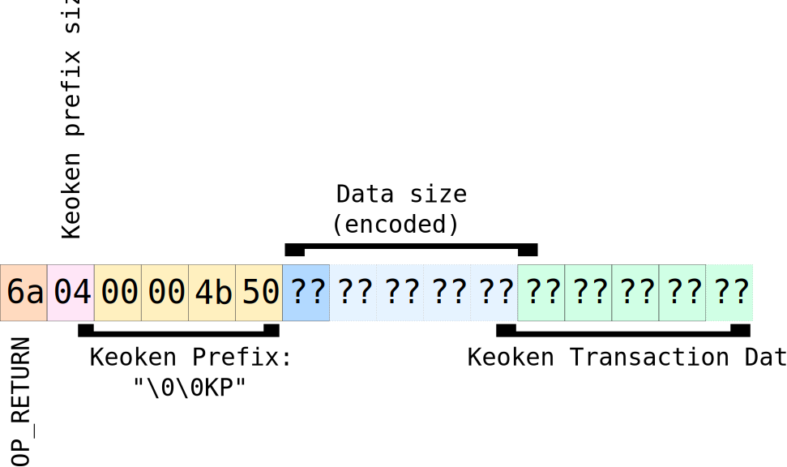

# Keoken

### 技术文档（草案）
### Version 0.1

**_Bitprim Argentina SRL_**

dev@bitprim.org

## Document Versioning

<table>
  <tr>
    <th>版本</th>
    <th>时间</th>
    <th>审核发布</th>
  </tr>
  <tr>
    <td>0.1</td>
    <td>2018-Jul-26</td>
    <td>Bitprim Project Inc.</td>
  </tr>
</table>

 
## 简介

本文档定义了Keoken协议支持的交易类型。

Keoken协议建立在与比特币脚本语言兼容的任何加密货币上。具体来说，Keoken需要OP_RETURN（0x6a）操作码。目前，Keoken可以通过比特币现金（BCH），比特币（BTC）和Litecoin（LTC）实施，但它不限于此。实现Keoken的加密货币称为Transport Currency或Transport Coin（以下简称Transport）。

## Keoken 交易

Keoken需通过与比特币脚本语言兼容的任何加密货币进行传输，且须支持OP_RETURN（0x6a）操作码。

交易协议如下：

- 前6个字节都是固定的而且是相通的。hex: 6a0400004b50.
- 下一个字节或字节表示Keoken数据部分的大小，其编码方式如下:

<table>
  <tr>
    <th>第一个字节</th>
    <th>Extra Bytes</th>
    <th>Description</th>
  </tr>
  <tr>
    <td>dec: 04 to 75 hex: 04 to 4b</td>
    <td>
-
</td>
    <td>没有多余的字节。数据部分的大小由第一个字节的值表示。</td>
  </tr>
  <tr>
    <td>dec: 76 hex: 4c OP_PUSHDATA1</td>
    <td>
1
</td>
    <td>第一个字节后面有一个额外的字节。数据部分的大小由该额外字节的值表示。</td>
  </tr>
  <tr>
    <td>dec: 77 hex: 4d OP_PUSHDATA2</td>
    <td>
2
</td>
    <td>第一个字节后面有两个额外的字节。数据部分的大小由这些额外字节的值以小的endian顺序表示。</td>
  </tr>
  <tr>
    <td>dec: 78 hex: 4e OP_PUSHDATA4</td>
    <td>
4
</td>
    <td>第一个字节后面有4个额外的字节。数据部分的大小由这些额外字节的值以小的endian顺序表示。</td>
  </tr>
</table>

  所以数据大小可以用1、2、3或5字节来表示。

- 在数据大小之后，必须再增加N个字节，其中N等于数据大小部分的值。这N个字节表示Keoken交易数据，它独立于传输协议，将在下面进行描述。

## Keoken 交易

Keoken交易是Transport Coin上的有效交易，因此它必须遵循Keoken协议增加后的Transport Coinplus新的相同的规则。
Keoken交易有几种类型（将来可能会创建新类型），每种类型都有自己的规则，并且所有Keoken交易类型都必须遵循一套通用规则。

如果Transport Coin交易符合以下一般规则，则该交易将被视为有效的Keoken交易：

1. 至少有一个输出符合Keoken Transportation中描述的格式。

Keoken协议始终用找到的第一个Keoken-Transportation-Compliant输出。
Keoken将忽略成功的Keoken-Transportation-Compliant输出。
其脚本包含OP_RETURN操作码但不符合Keoken-Transportation规则的输出将被Keoken忽略，尽管它可能是Transport Coin中的有效输出。

## 交易类型

* [创建资产](#创建资产)
* [发送token](#发送token)

## 交易模式

Keoken交易有如下头部信息：

<table>
  <tr>
    <th>字段名称</th>
    <th>数据类型</th>
    <th>说明</th>
  </tr>
  <tr>
    <td>版本</td>
    <td>16位无符号整数，大字节序格式</td>
    <td>Keoken协议版本。现在，对于所有交易类型，它都是0（零）。本规范的未来修订版可能会改变它。</td>
  </tr>
  <tr>
    <td>类型</td>
    <td>16位无符号整数，大字节序格式</td>
    <td>表示交易类型的整数</td>
  </tr>
  <tr>
    <td>特定数据</td>
    <td>N个字节</td>
    <td>动态数据，特殊交易类型。</td>
  </tr>
</table>

Keoken协议将忽略不符合此格式的交易。

## 交易类型规范

### **创建资产**

此交易用于创建新资产。 

格式

<table>
  <tr>
    <th>字段名称</th>
    <th>数据类型</th>
    <th>数据范围</th>
    <th>说明</th>
  </tr>
  <tr>
    <td>版本</td>
    <td>16位无符号整数，大字节序格式</td>
    <td>固定值：0x00</td>
    <td>Keoken协议版本</td>
  </tr>
  <tr>
    <td>类型</td>
    <td>16位无符号整数，大字节序格式</td>
    <td>固定值：0x00 </td>
    <td>交易类型：创建资产</td>
  </tr>
  <tr>
    <td>名称</td>
    <td>以空值终止的ASCII字符串</td>
    <td>最小字符串大小：2个字节，1个真实字符加上空字符（\ 0）。最大字符串大小：33个字节，32个真实字符加上空字符（\ 0）</td>
    <td>资产名称</td>
  </tr>
  <tr>
    <td>数量</td>
    <td>16位无符号整数，大字节序格式</td>
    <td>大于0（零）</td>
    <td>初始数量的代币</td>
  </tr>
</table>

如果字段的值超出指定范围或交易不符合下面详述的验证，则交易将被视为无效交易，即使它是 Transport Coin中的有效交易。因此，Keoken 编译器不会执行。

每个资产都有一个由Keoken生成的唯一的ID。第一个可用的Keoken资产ID以1（一）开始，并且每个新资产的增量为1。

以下是创建资产交易类型的特定规则和验证的列表：

1. 与第一个输入相关的地址将是资产的所有者。如果第一个输入没有相关地址，则该交易将被视为无效的Keoken交易。其他输入将被Keoken协议忽略，尽管它可能是Transport Coin中的有效输入。

2. 资产名必须为非空且以null结尾的ASCII编码字符串，最大为32字节+空字符为1字节。

3. 数量必须大于0（零）。

### **发送代币**

交易用于从源传输币地址向目标传输币地址发送代币。

格式:

<table>
  <tr>
    <th>字段名称</th>
    <th>数据类型</th>
    <th>数据范围</th>
    <th>说明</th>
  </tr>
  <tr>
    <td>版本</td>
    <td>16位无符号整数，大字节序格式</td>
    <td>固定值：0x00</td>
    <td>Keoken协议版本</td>
  </tr>
  <tr>
    <td>类型</td>
    <td>16位无符号整数，大字节序格式</td>
    <td>固定值：0x01</td>
    <td>交易类型：发送代币</td>
  </tr>
  <tr>
    <td>资产ID</td>
    <td>32位无符号整数，大字节序格式</td>
    <td>大于或等于资产的1（一）</td>
    <td>资产Id。必须使用“创建资产”交易创建它</td>
  </tr>
  <tr>
    <td>数量</td>
    <td>64位二进制补码有符号整数，big-endian格式</td>
    <td>大于0（零）</td>
    <td>要转移的代币数量</td>
  </tr>
</table>

以下是发送代币交易类型的特定规则和验证列表：

1.与第一个输入相关的地址将被视为源地址。如果第一个输入没有相关地址，则该交易将被视为无效的Keoken交易。其他输入将被Keoken协议忽略，尽管它可能是Transport Coin中的有效输入。

2.具有与源地址不同的相关地址的第一个输出将被视为Keoken交易的目标地址。如果地址不存在，则该交易将被视为无效的Keoken交易。其他输出将被Keoken协议忽略，尽管它可能是Transport Coin中的有效输出。

3.资产ID必须存在。 （必须使用Create Asset交易创建）。

4.数量必须大于0（零）。

5.数量必须小于或等于源地址帐户可用的代币。

## 举例

### 发代币

创建一个名为:Bitprim的新的Keoken资产，其中包含1000个Token。

资产的所有者将是钱包地址：**mgt5VsxNUroj9M2uQaTEwbc5am5LMh8F6v**.

使用所有者钱包作为第一个输入创建一个交易。输出必须是带有Keoken协议的OP_RETURN脚本。所有的加密货币减去矿工的费用可以被发送到另一个钱包。

UTXO数据为：

* 输出：aa699dc5ddf598a50dc2cb2cb2729629cb9d2d865df38e4367d13f81ef55f96e:0

* 数量： 49.9996 TBCH 

* 输出脚本： dup hash160 [0ef6dfde07323619edd2440ca0a54d311df1ee8b] equalverify checksig

交易例子:

* 01000000016ef955ef813fd167438ef35d862d9dcb299672b22ccbc20da598f5ddc59d69aa000000006a473044022056f0511deaaf7485d7f17ec953ad7f6ede03a73c957f98629d290f890aee165602207f1f1a4c04eadeafcd3f4eacd0bb85a45803ef715bfc9a3375fed472212b67fb4121036735a1fe1b39fbe39e629a6dd680bf00b13aefe40d9f3bb6f863d2c4094ddd0effffffff02a007052a010000001976a9140ef6dfde07323619edd2440ca0a54d311df1ee8b88ac00000000000000001b6a0400004b5014000000004269747072696d0000000000000f424000000000

重要数据:

* 输入地址:  mgt5VsxNUroj9M2uQaTEwbc5am5LMh8F6v

* 输出地址:  mgt5VsxNUroj9M2uQaTEwbc5am5LMh8F6v

* 输出脚本: 6a0400004b5014000000004269747072696d0000000000000f4240

脚本:

<table>
  <tr>
    <th>Hexa:</th>
    <th>Data</th>
  </tr>
  <tr>
    <td>6a</td>
    <td>OP_RETURN</td>
  </tr>
  <tr>
    <td>04</td>
    <td>OP_PUSH_DATA</td>
  </tr>
  <tr>
    <td>00004b50</td>
    <td>Prefix = "  KP"</td>
  </tr>
  <tr>
    <td>14</td>
    <td>OP_PUSH_DATA</td>
  </tr>
  <tr>
    <td>0000</td>
    <td>Keoken Version = 0</td>
  </tr>
  <tr>
    <td>0000</td>
    <td>Keoken Type = 0 (Create Asset)</td>
  </tr>
  <tr>
    <td>4269747072696d00</td>
    <td>Asset name = "Bitprim" (Null terminated)</td>
  </tr>
  <tr>
    <td>00000000000f4240</td>
    <td>Amount of tokens created = 1000000</td>
  </tr>
</table>

### 发送Tokens

发送 **100 个Bitprim** Tokens  from **mgt5VsxNUroj9M2uQaTEwbc5am5LMh8F6v** (发送方钱包) to **mgAbyFPdhCtUnnbayot2cbqudHGkFS8CsB** (目标钱包).

创建具有三个输出的交易:

* 第一次输出: dust to the destination wallet.

* 第二次输出: utxo satoshis minus dust minus miner fee.

* 第三次输出: Keoken message.

UTXO数据为：

* 输出： 2fcb4d3c432fbc14ec709b1592a0c3b121c22de7525b789071f6cff27126571e:0

* 数量： 49.9994 TBCH 

* 输出脚本： dup hash160 [0ef6dfde07323619edd2440ca0a54d311df1ee8b] equalverify checksig

交易例子

* 01000000011e572671f2cff67190785b52e72dc221b1c3a092159b70ec14bc2f433c4dcb2f000000006b48304502210084c05aa0d2a60f69045b46179cff207fde8003ea07a90a75d934ec35d6a46a3a02205b328724e736d9400b3f13ac6e0e49462048dfc2c9a7bd1be9944aa9baa455144121036735a1fe1b39fbe39e629a6dd680bf00b13aefe40d9f3bb6f863d2c4094ddd0effffffff03204e0000000000001976a914071ed73aa65c19f86c88a29a789210fafc8d675188ac606b042a010000001976a9140ef6dfde07323619edd2440ca0a54d311df1ee8b88ac0000000000000000176a0400004b50100000000100000002000000000000006400000000

重要数据:

* 输入地址: mgt5VsxNUroj9M2uQaTEwbc5am5LMh8F6v

* 输出地址1: mgAbyFPdhCtUnnbayot2cbqudHGkFS8CsB

* 输出地址2: mgt5VsxNUroj9M2uQaTEwbc5am5LMh8F6v

* 输出脚本3: 6a0400004b501000000001000000020000000000000064

<table>
  <tr>
    <th>Hexa:</th>
    <th>Data</th>
  </tr>
  <tr>
    <td>6a</td>
    <td>OP_RETURN</td>
  </tr>
  <tr>
    <td>04</td>
    <td>OP_PUSH_DATA</td>
  </tr>
  <tr>
    <td>00004b50</td>
    <td>Prefix = "\0\0KP"</td>
  </tr>
  <tr>
    <td>10</td>
    <td>OP_PUSH_DATA</td>
  </tr>
  <tr>
    <td>0000</td>
    <td>Keoken Version = 0</td>
  </tr>
  <tr>
    <td>0001</td>
    <td>Keoken Type = 1</td>
  </tr>
  <tr>
    <td>00000002</td>
    <td>Asset ID = 2</td>
  </tr>
  <tr>
    <td>0000000000000064</td>
    <td>Amount of tokens sent = 100</td>
  </tr>
</table>

